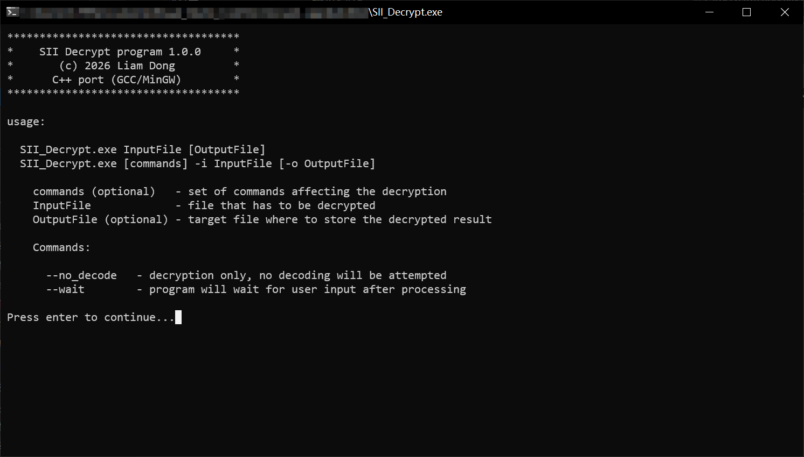
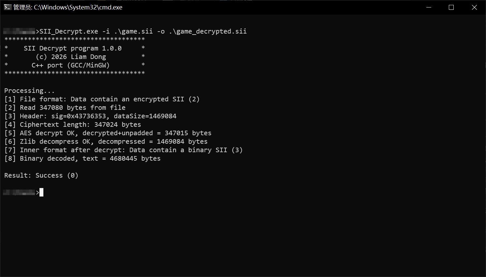

# SII Decrypt (C++)

> *A C++ rewrite of the discontinued Pascal project [SII_Decrypt](https://github.com/TheLazyTomcat/SII_Decrypt) by TheLazyTomcat, with support for newer game versions.*


Languages: [简体中文](README.zh-CN.md) | **English**

SII Decrypt converts **Euro Truck Simulator 2** and **American Truck Simulator** save files into human-readable plain-text SII, so they can be inspected, edited, and used with save-game tools.

---

## Preview



## Table of Contents

- [Features](#features)
- [Supported Formats](#supported-formats)
- [How It Works](#how-it-works)
- [Building](#building)
- [Console Usage](#console-usage)
- [DLL / C API](#dll--c-api)
- [Project Structure](#project-structure)
- [Credits](#credits)
- [License](#license)

---

## Features

- **Automatic format detection** — recognizes `SiiN`, `ScsC`, `3nK#01`, and `BSII` on the fly
- **AES-256-CBC decryption** — self-contained implementation, no OpenSSL required
- **BSII binary decoding** — new in this project; handles the binary saves of game 1.45+
- **3nK decoding** — XOR decoding with the 256-byte key table
- **Zero dependencies** — hand-written AES and DEFLATE, fully static binaries
- **Console + DLL** — command-line tool plus a C-compatible DLL (API v1.1, drop-in replacement for the original Pascal DLL)

---

## Supported Formats

The game has changed its save format several times over the years. This tool detects the format automatically and handles them all:

| Signature | Format | Handling |
|-----------|--------|----------|
| `SiiN` | Plain-text SII | left as-is |
| `ScsC` | Encrypted SII | AES-256-CBC decrypt + zlib inflate |
| `3nK#01` | 3nK-encoded SII | XOR decoding with a 256-byte key table |
| `BSII` | Binary SII (versions 1–3) | parsed and converted to text |

## How It Works

A save file (e.g. `game.sii`) goes through this pipeline:

```
Encrypted file (.sii)
  │  "ScsC" 56-byte header: Signature + HMAC[32] + IV[16] + DataSize
  ▼
AES-256-CBC decrypt (PKCS#7 unpadding)
  ▼
zlib / DEFLATE decompress
  ▼
inner format detection
  ├─ "3nK#01" ──► 3nK decode (XOR with KeyTable[(seed + pos) % 256])
  ├─ "BSII"   ──► binary SII decode → text
  └─ "SiiN"   ──► already plain text
  ▼
Readable SII text
```

Everything is **self-contained**: the AES-256 implementation, the DEFLATE (RFC 1950/1951) decompressor, the 3nK decoder, and the BSII parser are all written from scratch — no OpenSSL, no zlib, no external libraries.

## Building

Requirements:

- **MinGW-w64** (`g++` with 32-bit target support, i686)
- **GNU Make**

### 32-bit build

This project is intentionally built as a **32-bit** binary (`-m32` is set in the Makefile by default) and should stay that way unless you have a specific reason to change it:

- The original Pascal `SII_Decrypt.dll` was 32-bit; keeping the same target makes this DLL a drop-in replacement that existing tools can load without modification.
- The console program and DLL remain fully functional as 32-bit binaries on 64-bit Windows, while avoiding any mismatch with 32-bit host tools.

The Makefile locates the toolchain through a `mingw32` variable, which is not defined in the file — pass it on the command line, or edit the Makefile to hard-code it:

```bat
mingw32-make all mingw32=C:\Tools\mingw32\bin
```

Targets:

| Target | Output |
|--------|--------|
| `make all` | `build\SII_Decrypt.dll` + `build\SII_Decrypt.exe` |
| `make dll` | `build\SII_Decrypt.dll` (+ import library `build\lib\libsii_decrypt.a`) |
| `make console` | `build\SII_Decrypt.exe` |
| `make clean` | remove build artifacts |

Both binaries are fully static and stripped (no MinGW runtime DLLs required).

## Console Usage

```
SII_Decrypt.exe InputFile [OutputFile]
SII_Decrypt.exe [commands] -i InputFile [-o OutputFile]
```

If no output file is given, the decrypted result **overwrites the input file**.

**Commands:**

| Command | Effect |
|---------|--------|
| `--no_decode` | Decrypt only — skip 3nK / BSII decoding |
| `--wait` | Wait for a keypress after processing |

**Examples:**

```bat
REM Decrypt and decode, overwriting the original
SII_Decrypt.exe "C:\Users\me\Documents\Euro Truck Simulator 2\profiles\4D61696E\save\1\game.sii"

REM Write the result to a separate file
SII_Decrypt.exe -i "game.sii" -o "game_decrypted.sii"

REM Decrypt only, keep the 3nK-encoded payload
SII_Decrypt.exe --no_decode -i "game.sii" -o "game_decrypted_only.sii"
```

Save files are located at:

```
%USERPROFILE%\Documents\Euro Truck Simulator 2\profiles\<profile>\save\<id>\
%USERPROFILE%\Documents\American Truck Simulator\profiles\<profile>\save\<id>\
```

## DLL / C API

The DLL exports the same C API as the original Pascal `SII_Decrypt.dll` (API version 1.1), plus the new functions. It can be used from any language that supports `__stdcall` C exports — C, C++, Delphi/Lazarus, C#, etc.

See [include/sii_decrypt.h](include/sii_decrypt.h) for the full API documentation.

### Standalone functions

```c
#include "sii_decrypt.h"

/* Detect what a file contains */
int32_t fmt = GetFileFormat("game.sii");
/* 1 = plain text, 2 = encrypted, 3 = binary, 4 = 3nK, 10 = unknown */

/* Quick checks */
if (IsEncryptedFile("game.sii"))   { /* ... */ }
if (Is3nKEncodedFile("game.sii"))  { /* ... */ }

/* One-call decrypt + decode to a file */
int32_t res = DecryptAndDecodeFile("game.sii", "game_decrypted.sii");
```

Memory-based functions (`DecryptMemory`, `DecodeMemory`, `DecryptAndDecodeMemory`) use a **two-pass** protocol: call once with `Output = NULL` to query the required buffer size, allocate, then call again with the buffer. The `...MemoryHelper` variants add an opaque helper object so the second pass does not redo the decoding work — free it with `FreeHelper()` if you abort between the passes.

### Object API (v1.1)

An object-based API is also available, mirroring the Pascal original:

```c
TSIIDecryptorObject dec = Decryptor_Create();

Decryptor_SetOptionBool(dec, SIIDEC_OPTIONID_ACCEL_AES, 1);   /* enabled by default */
Decryptor_SetOptionBool(dec, SIIDEC_OPTIONID_DEC_UNSUPP, 0);  /* decode unsupported BSII values */
Decryptor_SetProgressCallback(dec, MyProgressCallback);       /* progress in [0.0, 1.0] */

int32_t res = Decryptor_DecryptAndDecodeFile(dec, "game.sii", "game_decrypted.sii");

Decryptor_Free(&dec);
```

### Result codes

| Code | Meaning |
|------|---------|
| `0` | Success |
| `1` | Data is plain-text SII (nothing to decrypt) |
| `2` | Data is encrypted SII |
| `3` | Data is binary SII |
| `4` | Data is 3nK-encoded |
| `10` | Unknown format |
| `11` | Too few data to contain a valid format |
| `12` | Output buffer too small |
| `-1` | Generic error |

## Project Structure

```
SII-Decrypt-cpp/
├── include/
│   └── sii_decrypt.h          Public C API header (DLL exports)
├── src/
│   ├── core/
│   │   ├── sii_types.h        Shared types, signatures, result codes
│   │   ├── sii_format.cpp/.h  Format detection, AES+DEFLATE step, 3nK decode
│   │   ├── sii_decryptor.cpp/.h  High-level SIIDecryptor class
│   │   ├── sii_bin_types.h    BSII structures and value types
│   │   ├── sii_bin_utils.*    Parsing helpers
│   │   ├── sii_bin_value.*    Value decoding
│   │   ├── sii_bin_data.*     Data block parsing
│   │   └── sii_bin_decoder.*  Entry point: BSII buffer → text
│   ├── crypto/
│   │   └── aes256.cpp/.h      Self-contained AES-256-CBC decrypt
│   ├── compress/
│   │   └── inflate.cpp/.h     Minimal zlib/DEFLATE decompressor (RFC 1950/1951)
│   ├── sii_console.cpp        Console program
│   ├── sii_dll.cpp            DLL entry points (C API wrapper)
│   └── sii_decrypt.def        DLL export definition
├── Makefile                   MinGW build
└── LICENSE                    MIT License
```

## Credits

- [TheLazyTomcat](https://github.com/TheLazyTomcat) — original Pascal [SII_Decrypt](https://github.com/TheLazyTomcat/SII_Decrypt) project, whose API and behavior this port follows.

## License

This project is licensed under the [MIT License](LICENSE)

Copyright © 2026 <a href="https://github.com/liam-dong">Liam Dong</a>.
